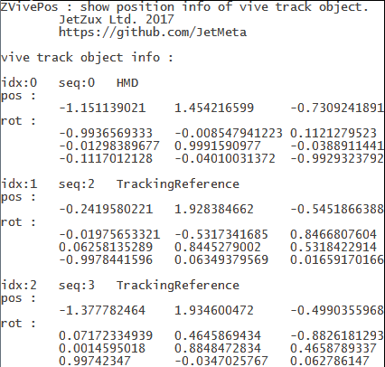

# ZVivePos : show position info of vive track object.
- trivial demo : show position info of vive track object.
- JetZux Ltd. 2017 https://github.com/JetMeta

## download

[Release](https://github.com/JetMeta/ZVivePos/tree/master/bin "Release")

## usage
- show position info of vive track object.

## changelog
### [0.00.01] - 2017-11-02
- add property info

### [0.00.01] - 2017-11-01
#### init
- usage : show position info of vive track object.
- add controller role info.
